## Part 1. Готовый докер

* 1.1 Использование команды docker pull для выкачки докера nginx 
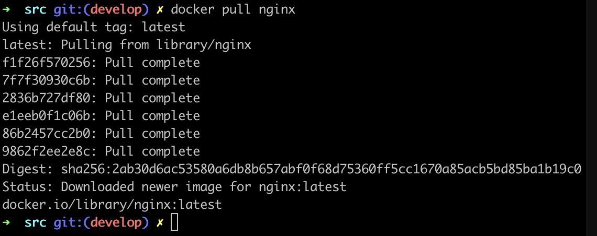 docker pull 
* 1.2 Проверка наличия докер образа при помощи команды docker images 
* 1.3 Запуск докер образа при помощи команды docker run -d image_id 
* 1.4 Проверка запуска докера при помощи команды docker ps 
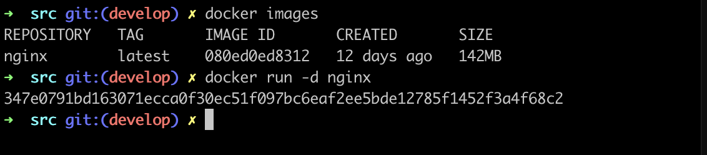
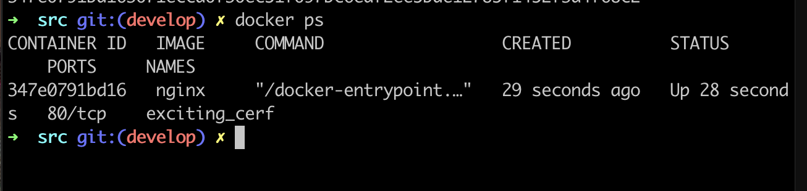
 Запуск и проверка докер образа 
* 1.5 Просмотр информации о контейнере при помощи команды docker inspect container_id 
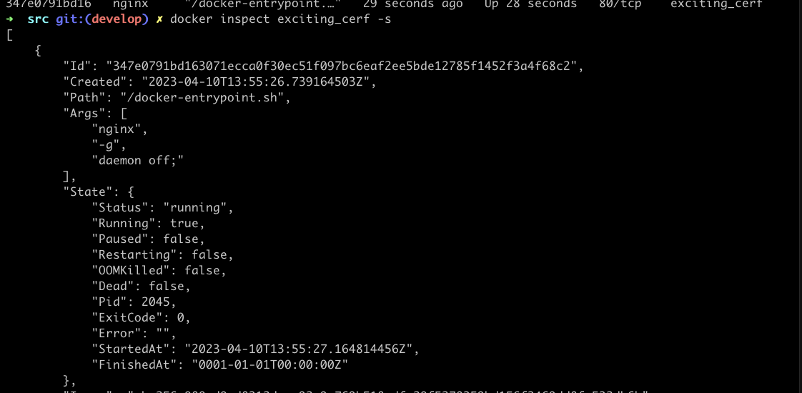 Запуск docker inspect 
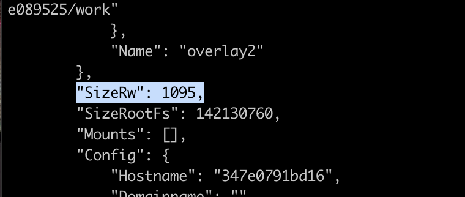 Размер контейнера 
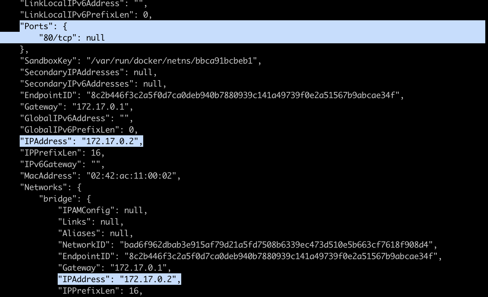 Список замапленных портов и ip контейнера 
* 1.6 Остановка докер образа и проверка, что он остановился 
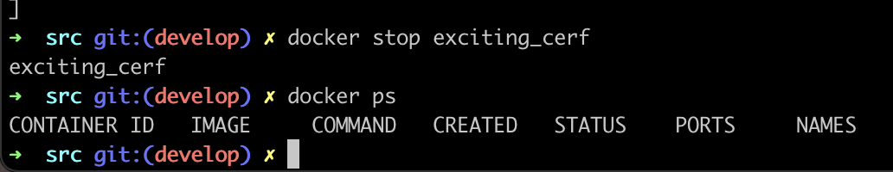 Остановка и проверка докер образа 
* 1.7 Запуск докера с замапленными портами 80 и 443 
* 1.8 Проверка на доступность стартовой страницы nginx по адресу localhost:80 в браузере 
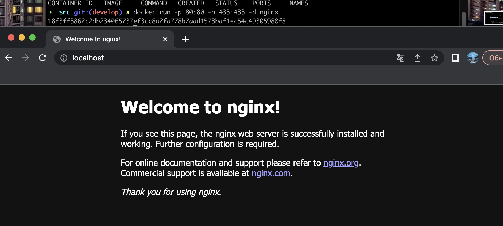 Запуск докера с замапленными портами и проверка localhost:80 
* 1.9 Перезапуск докера и проверка, что он запустился 
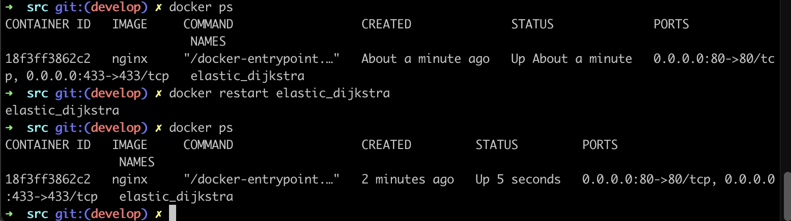 Рестарт докера 

## Part 2. Операции с контейнером

* 2.1 Вывод содрежимого файла nginx.conf 
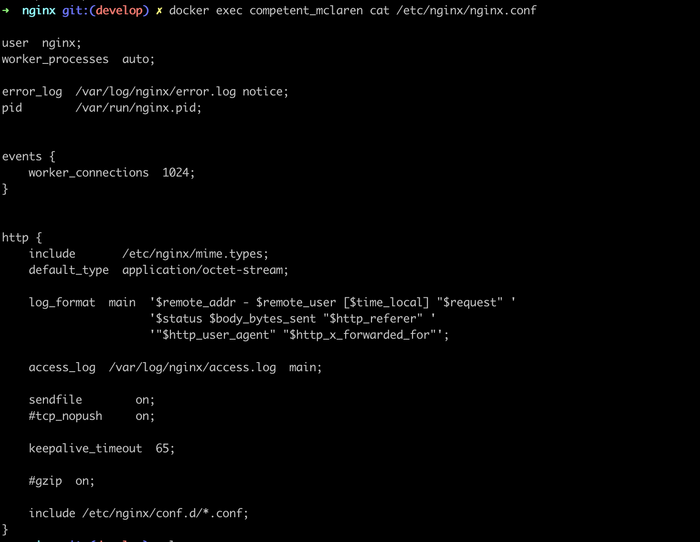 nginx.conf 
* 2.2 Создание на локальной машине файла nginx.conf. Настройка в нем по пути /status отдачу страницы статуса сервера 
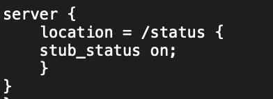 Содержимое nginx.conf 
* 2.3 Копирование файла nginx.conf внутрь докер образа. Перезапуск nginx внутри докер образа. Проверка статуса сервера 
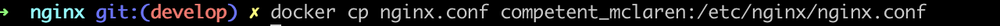 Копирование файла 
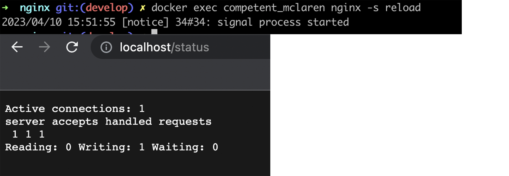 Перезапуск nginx и проверка статуса сервера 
* 2.4 Экспорт контейнера в файл container.tar через команду export 
* 2.5 Остановка контейнера 
* 2.6 Удаление образа через docker rmi [image_id|repository], не удаляя перед этим контейнеры 
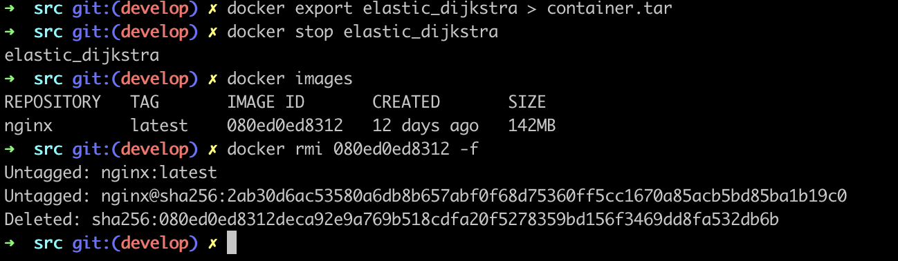 Экспорт и остановка контейнера, удаление образа 
* Импорт контейнера обратно через команду import 
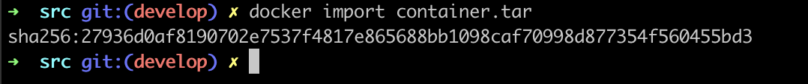 Импорт контейнера 
* 2.7 Запуск импортированного контейнера 
Скриншот умер. Делалось через docker run -dt containerid /bin/bash 

## Part 3. Мини веб-сервер

* 3.1 Создание сервера на языке С 
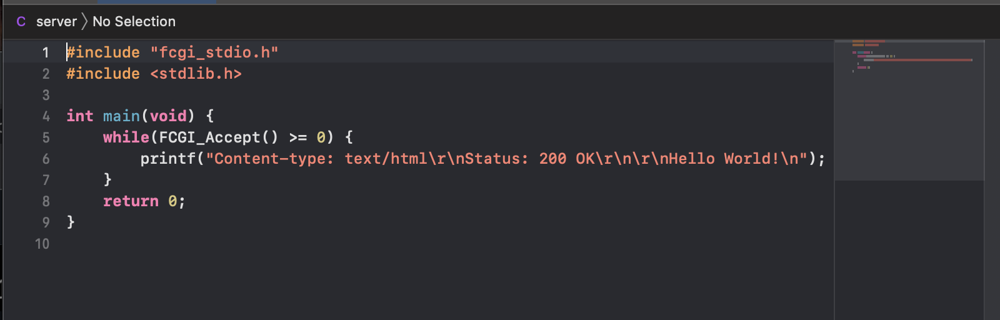 Сервер 
* 3.2 Создание nginx.conf 
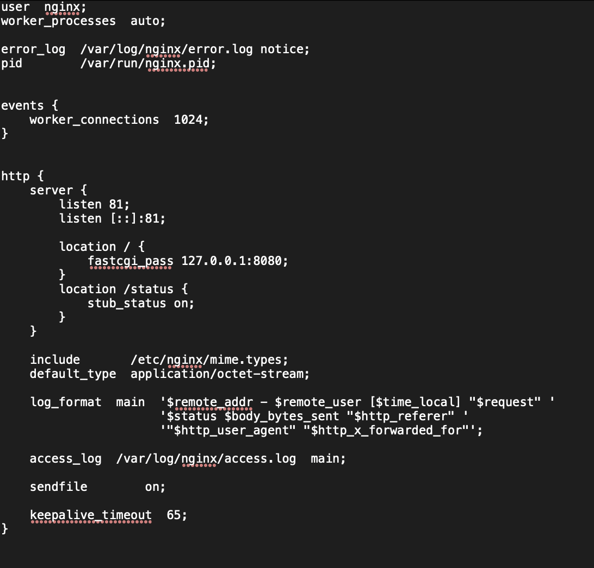 nginx.conf 
* 3.3 Выкачка докера nginx. Проверка, что загрузка прошла успешно. Запуск образа и проверка, что он запустился 
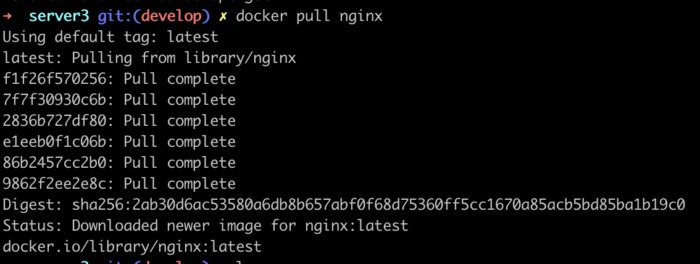 
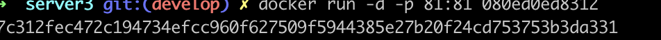 
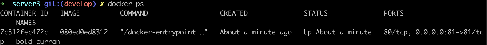 Выкачка докера nginx и проверка 
* 3.4 Копирование nginx.conf и server.c в докер-контейнер 
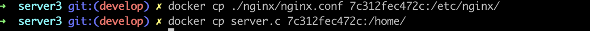 Копирование nginx.conf и server.c 
* 3.5 Вход в сам контейнер. Проверка, что файлы успешно скопировались 
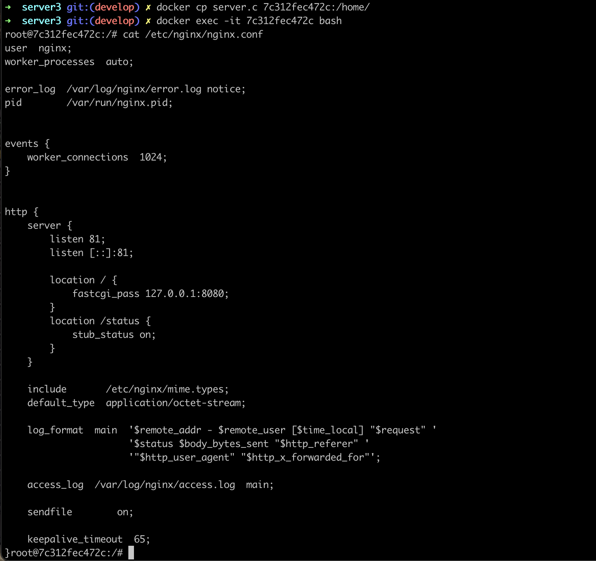 Вход в контейнер и проверка файлов 
* 3.6 Обновление контейнера. Установка gcc, spawn-dcgi, libfcgi-dev 
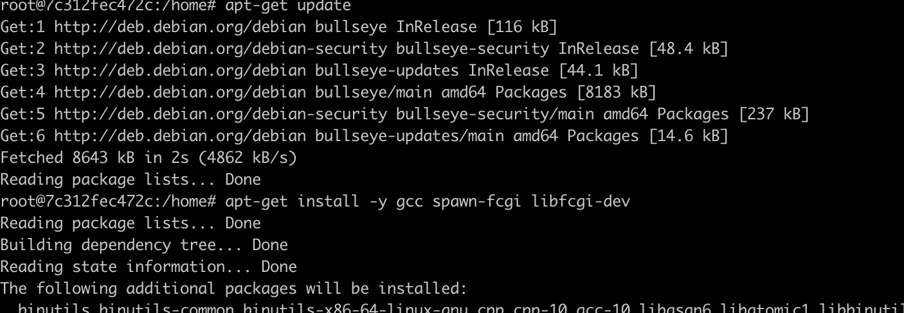 Обновление контейнера и установка утилит 
* 3.7 Компиляция и запуск нашего сервера 
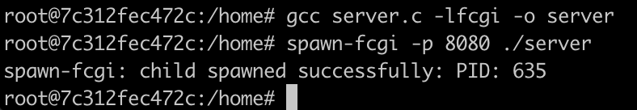 Запуск сервера 
* 3.8 Перезагрузка контейнера и проверка страницы 
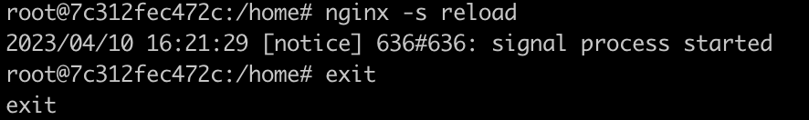
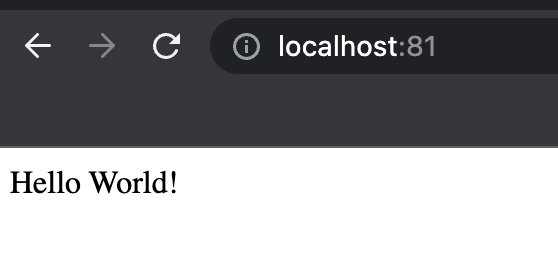 Перезагрузка контейнера и проверка страницы 

## Part 4. Свой докер

* 4.1 Создание докер образа. 
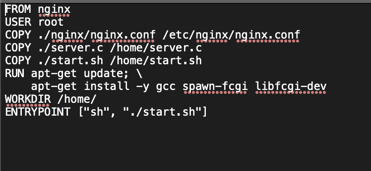 Dockerfile 
* 4.2 Запуск скрипта из докера 
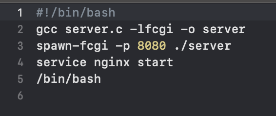 Скрипт запуска 
* 4.3 Сбор написанного образа. Маппинг 81 порта на 80. Проверка доступа стрички командной localhost:80 
 Сбор образа 
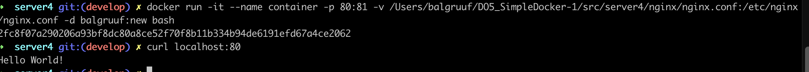 Маппинг и проверка доступа 
* 4.4 Проверка на корректность сборки 
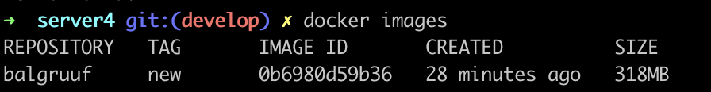 Проверка на корректность сборки 
* 4.5 Добавление в файл nginx.conf проксирование странички /status 
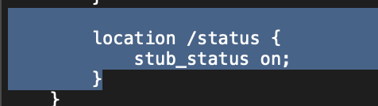 nginx.conf 
* 4.6 Проверка странички /status 
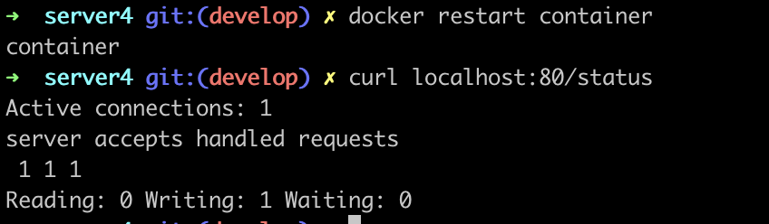 Проверка странички 

## Part 5. **Dockle**

* 5.1 Сканирование образа 
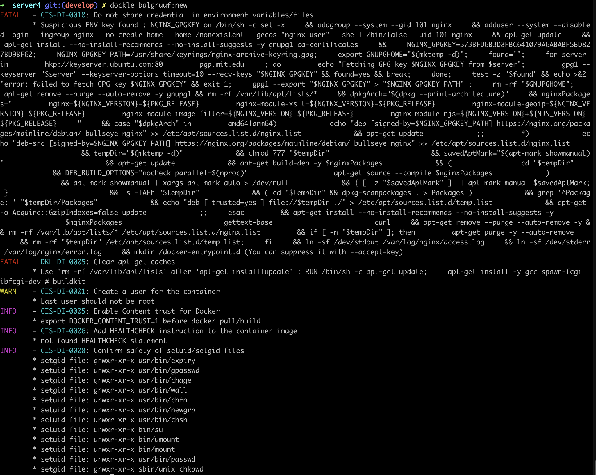 Сканирование образа 
* 5.2 Проверка на отсутствие ошибок и предупреждений после исправления образа 
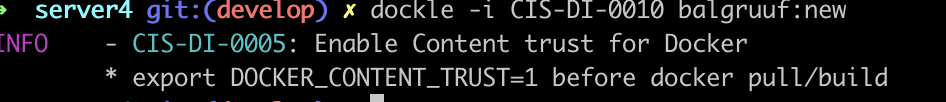 Проверка ошибок 

## Part 6. Базовый **Docker Compose**

* 6.1 Файл docker-compose.yml 
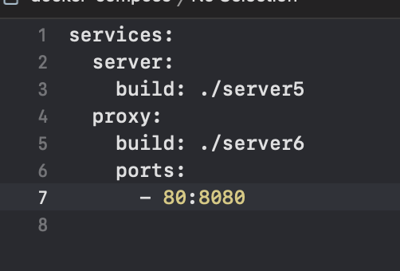 docker-compose.yml 
* 6.2 Проверка на работоспособность после сборки и запуска 
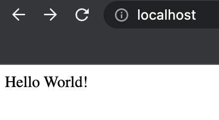 Проверка на работоспособность 
